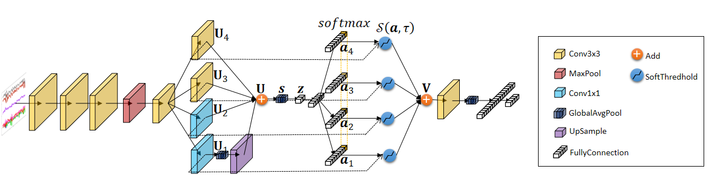
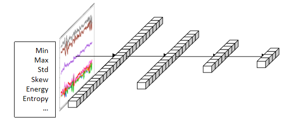
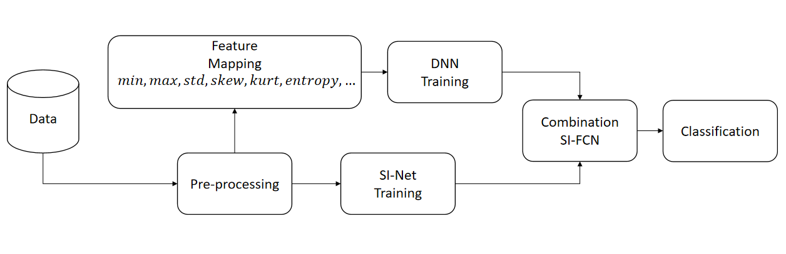

# SI-FCN:Soft-Thresholding Inception Network for Human Activity Recognition
## Approach

  

  Figure 1: The Diagram of a Soft-Thresholding Inception Network.

  

  Figure 2: The Diagram of a Fully Connected Network.

  

  Figure 3: The Models training and deployment flowchart.

## implement
In this repository, all the models are implemented by [TensorFlow](https://github.com/tensorflow).

We use the data augmentation strategies with IS-Net and FCN.

In the training phase, we trained two models separately
## requirements
tensorflow-gpu==2.8
cuda==11.3.1
cudnn==8.2.1
## Dataset Download
[UCI-HAR](http://archive.ics.uci.edu/ml/datasets/Human+Activity+Recognition+Using+Smartphones)
[WISDM](https://www.cis.fordham.edu/wisdm/dataset.php)
